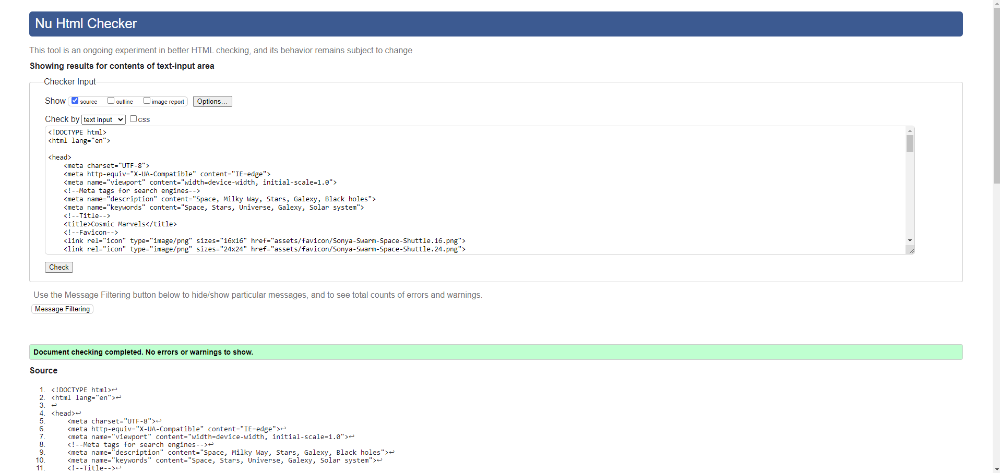

 # Cosmic Marvels 

This is a static website dedicated to all things space. Information regarding all things in the cosmos as well as high-quality images and tons of information on the subject. This is also a subscription page so you never miss the latest news.

     

# Contents

* Target Audience
* Design
* Features
* Technologies and languages used
* Deployment & Local Development
* Testing
* Credits

# Target Audience

The target audience for the "Cosmic Marvels" website includes space enthusiasts, science and astronomy students, educational institutions, the general public with a curiosity about space, individuals interested in receiving regular updates and exclusive content related to cosmic events through newsletters, and social media users engaging with platforms for additional content and updates. The website aims to cater to both those with a scientific background and a broader audience interested in accessible information and engaging with the wonders of the cosmos.

* Individuals interested in space exploration, astronomy, and celestial events.
* Students studying astronomy, astrophysics, or related scientific fields who seek additional resources and information.
* Schools and universities looking for educational content related to space and cosmic phenomena.
* People who have a general interest in space but may not have a scientific background. 

# Design

### Color scheme

I went with a very rigid color scheme with the hex color #010b19 as I felt this color suited the theme of space and the cosmos. RGB value is (1,11,25).

### Typography

I went for a Google font Jost as I felt it fitted the theme and it looks modern. Please see screenshot below. 

### Wireframes

Home page

Cosmic Events

Sign up

# Features
## Navbar
I created the nav bar that has a drop down toggle menu when in mobile mode and the options in word form on bigger screens.

Below shows the drop-down menu in action.

## Social media links

I added four social media links to the bottom of each page that link directly to Facebook, Youtube, Twitter and Instagram.

## Pages

# Technologies and languages used

Github - Used for storage of my site and for publishing online.
HTML5 - The core of the site was built with HTML version 5.
Python - Used python 3 via the terminal to preview my site using a local http server.
CSS - CSS was used to style the website and define fonts and layout.
Font Awesome - Social Media icons from Font Awesome.
Google Chrome - The website was built and tested in google Chrome.
Favicon Generator Website - Converted PNG file that I made from the logo using photoshop and converted it into a favicon on website favicon.io\

# Deployment & Local Development

I deployed everything my website onto gitpages.

How to Clone
Log into your account on github:

Go to the repository of this project Markmcl25/Space-First-project/
Click on the code button, and copy your preferred clone link.
Open the terminal in your code editor and change the current working directory to the location you want to use for the cloned directory.
Type 'git clone' into the terminal, paste the link you copied in step 3 and press enter.

How to Fork:

Log into your account on github
Go to the repository of this project /Space-First-project/.
Click on the code button, and copy your preferred clone link.
Open the terminal in your code editor and change the current working directory to the location you want to use for the cloned directory.
Type 'git clone' into the terminal, paste the link you copied in step 3 and press enter.

# Testing

I tested the code using Nu Html Checker.

Each device tested the site using the following browsers:

Google Chrome
Safari
Firefox

# Credits

Font Awesome - Social Media icons from Font Awesome.

Google Chrome - The website was built and tested in google Chrome.

Images from Google.

https://app.diagrams.net/ used for wireframe

https://cloudconvert.com/md-converter for compressing images

